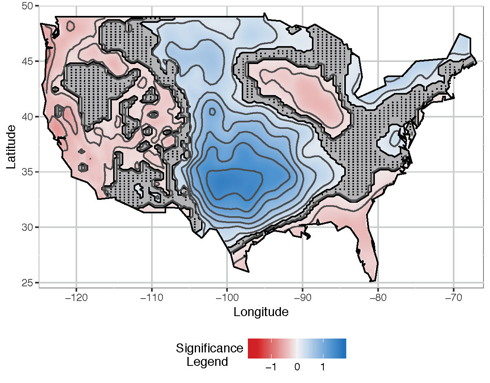

# Computing Confidence Intervals via Penalized Quantile Regression Splines
## Joint work with Enrique del Castillo, Martin Tingley, Andew Berglund and Nirmal Govind.

> The paper presents new methodology for the computation of pointwise con-fidence intervals from massive functional data sets.

We utilize more robust and flexiblequantile regression splines to allow heteroscedasticity and then estimate the functionalform of  any quantile level of the response. 

Our method introduces a  new criterion for selecting the penalization coefficient, and incorporates, via bootstrapping and generatingempirical confidence intervals, the variability of the fitted quantile function, including the uncertainty in the penalty coefficient.  

To improve scalability of the method for massivedatasets, the __bag of little bootstraps__ was adapted for quantile regression splines.  Coverage analysis is presented to demonstrate the performance of the computed confidencebands or surfaces.  

An R package, `ConfidenceQuant`, implements the new method.  

The approach has broad applications, including analysis of massive spatial data sets, analysis of large-scale computer model experiments, and analysis of experiments seeking tooptimize the quality of video streaming over the Internet.  

We illustrate the methodologyby comparing daily summertime maximum temperature projections from NASA’s Earth Exchange climate models. We consider two different CO2 emissions scenarios, and compare projections over the continental United States for the mid and late 21st Century, respectively.

![plot1](plots/T0_5.png}

